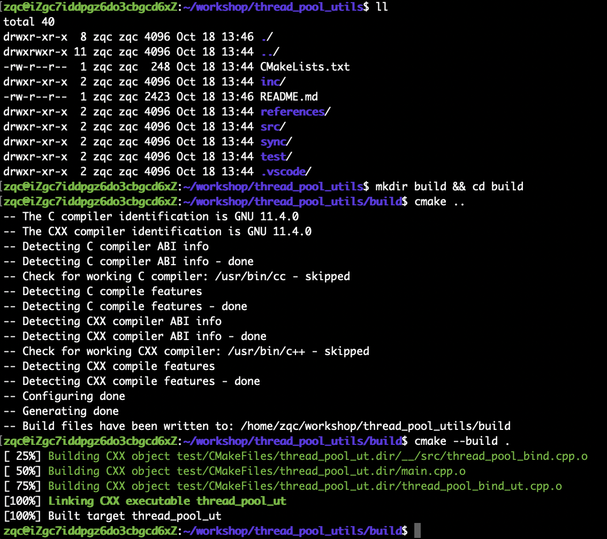
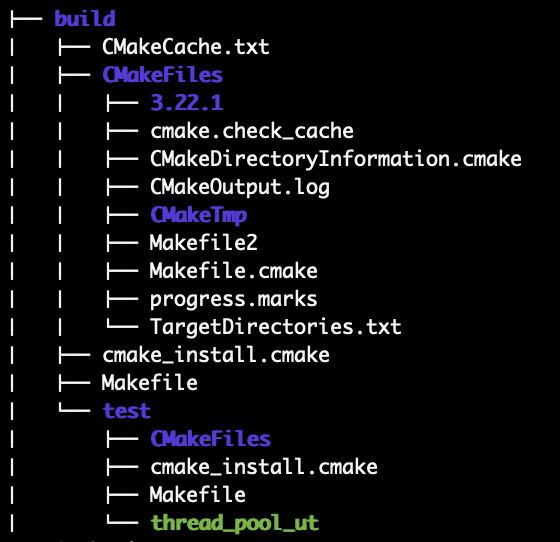
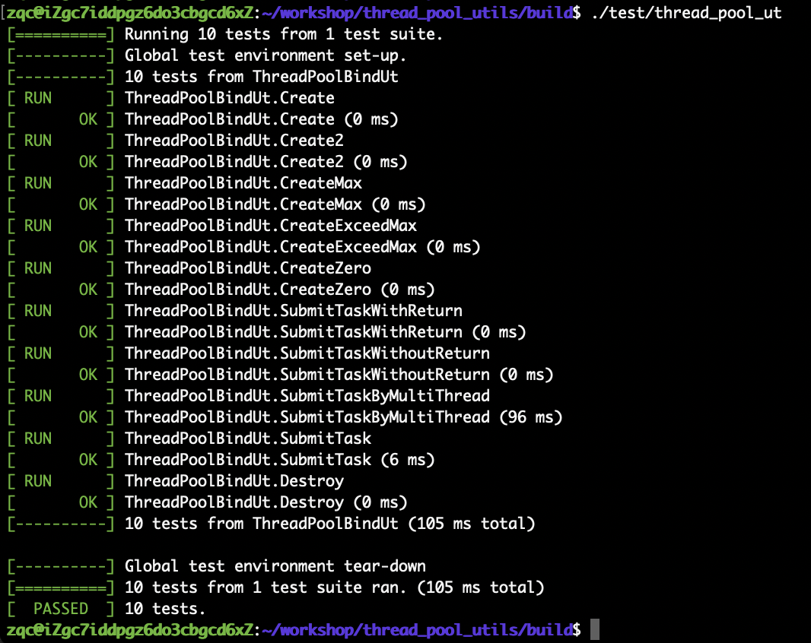

# ThreadPoolUtils

## 介绍

本库文件，提供了多种线程池和线程同步机制的实现例子，并为其提供了调试环境。

通过gtest测试架构和cmake编译框架，得到可验证标准化的线程池

## 工程结构介绍

| 文件/目录名 | 说明                                                   |
| ----------- | ------------------------------------------------------ |
| src         | 源码实现 |
| inc         | 头文件接口目录 |
| doc         | 文档目录 |
| test        | 测试源码目录 |
| CMakeLists.txt | 顶层cmake构建文件 |

### src

#### thread_pool_bind.h

线程池实现，使用std::bind绑定函数对象和入参实现，可以支持用户传入各种函数实现进入同一线程池进行调度执行。但由于需要支持传入的各种函数实现和入参，移动和拷贝较多，限制了执行效率

#### thread_pool.h

线程池实现，构造是需要用户指定线程池执行的回调函数，并指定参数。

由于指定了回调函数，有效减少数据拷贝和移动，提高了执行效率

#### sync

提供了std::async函数、condition_variable、std::promise、std::future、std::shared_future等多种线程同步机制的实现实例

### docs

#### references

其他线程池参考实现代码，包括github参考实现、KIMI大语言模型生成实现

### test

#### thread_pool_bind_ut.cpp

由于不需要准备测试套，所以仅需使用TEST测试套件，验证线程池功能

用例覆盖：线程的创建和销毁、任务的提交和管理、线程同步和锁管理、错误处理、资源回收

## 编译

### 编译环境

本代码库提供了基于GoogleTest测试套件的测试用例

编译所需的第三方源码和工具的推荐版本如下：

| 编译源码和工具   | 推荐版本 | 下载链接                                                     |
| -------------- | -------- | ------------------------------------------------------------ |
| googletest     | 1.15.2    | https://github.com/google/googletest/releases/tag/v1.15.2 |
| cmake | 3.20.5 | https://cmake.org/files/v3.20/cmake-3.20.5-linux-x86_64.tar.gz |

### 编译执行

1. 创建构建目录：

    为了避免在源代码目录中生成构建文件，在项目根目录下创建一个单独的构建目录

    ```shell
    mkdir build && cd build
    ```

2. 生成运行CMake：

    在构建目录中运行CMake，指定源代码目录。这个命令会根据CMakeLists.txt文件生成适合系统的构建系统

    ```shell
    cmake ..
    ```

3. 构建项目：

    使用生成的构建系统进行编译

    ```shell
    cmake --build .
    cmake --build . --target target_name #编译特定目标
    ```

### 编译输出

编译成功后，可以看到



可以看到cmake生成的编译中间件和编译结果目录如下



### 编译执行

编译完成后，执行二进制文件



## TODO List

1. 线程池支持任务配置优先级
2. 线程池支持增加和减少线程数量
2. sync目录下的其他线程同步机制，也提供测试用例覆盖
3. 使用ASAN工具检查内存泄漏

欢迎您提需求

## 附录

### GoogleTest测试工具构建

1. 下载Google Test源码：

    ```shell
    git clone https://github.com/google/googletest.git
    ```

2. 创建构建目录：

    ```shell
    cd googletest
    mkdir build
    cd build
    ```

3. 使用CMake生成构建文件

    ```shell
    cmake ..
    ```

4. 编译Google Test,使用make命令编译Google Test，生成静态库文件

    ```shell
    make
    ```

5. 安装Google Test（可选）：
    将Google Test安装到系统目录，可以使用sudo make install命令。这会将头文件安装到/usr/local/include，静态库安装到/usr/local/lib64

    ```shell
    sudo make install
    ```
